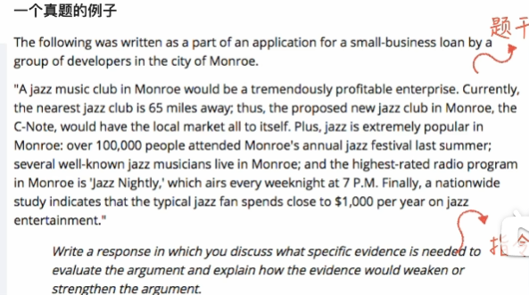
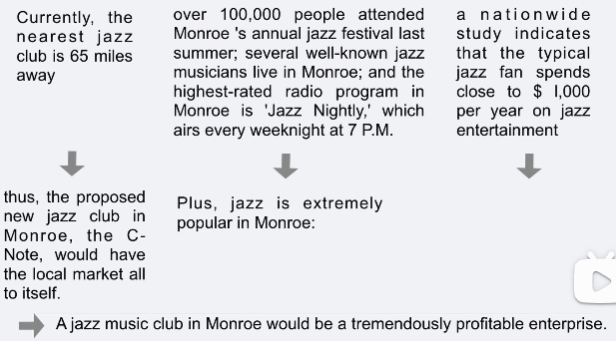

## Analytical writing

先写一篇issue 30min
再写一篇argument 30min

issue 正常的写作
argument要指出作者的论证问题


### 1. issue 万能模板

首先对题目进行分析。第一句是题干，第二局是instruction

```
Educational institutions have a responsibility to dissuade
students from pursuing fields of study in which they are
unlikely to succeed.
Write a response in which you discuss the extent to
which you agree or disagree with the claim.In
developing and supporting your position,be sure to
address the most compelling reasons and/or examples
that could be used to challenge your position.
```


gre中，instruction有六种
1. you should consider ways in which the statement might or might not hold true.
2. describe specific circumstances in which adopting the recommendation would or would not be advantageous and explain how these samples shape your position.
3. be sure to address the most compelling reasons and/or examples that could be used to challenge your position.
4. address both of the views presented
5. agree or disagree with the claim and the reason on which that claim is based.
6. you should consider the possibility consequences of implementing the policy and explain how these consequences shape your position.

六个指令都是辩证。关键是表达出立场

### 2. 方法：立场竖轴
2 完全同意
1 有保留的同意
0 中立
-1 有保留的不同意
-2 完全不同意

在issue中，完全不可以写的是2和-2，最好也不要写0，因为中立是非常难写的

模板 反 正 升
反：B为什么对/A为什么不对
正：A为什么对
升：A和B的关系，A和B的本质

最开始让步以及最后升华真是非常重要，升华写得好分数没烦恼

针对上面的例题，选择立场-1
也就是对方立场是同意学校有义务劝退的

反：为什么学校有义务劝退
``1.诚然，当代大学是为整个社会输送人才的，一定程度上承担了维持人才供需
平衡的责任。如果一个领域人才已经饱和，或前途黯淡，大学说服学生谨慎
选择，无可厚非。``

正：一定要给出详实的理由
``但是，真正掌握决定权的依然是学生而不是大学。1)时代变化，现在看似
不成功的领域，也许以后会成功。2)即使是坑专业，如果学生真心热爱，
努力付出，可能会取得更大的成就。``

升华：透过现象看本质，站在更高的角度去看问题
``这个问题的本质，是我们如何定义成功，以及我们如何定义当代大学的角色。
如果成功只是会所嫩模，大学只是合格工人的流水线，那么学校确实有义务
劝退学生。但是成功的定义是多样的，大学除了一纸文凭，还是青年挥洒热
情、挖掘潜力的地方，因此，大学没有劝退学生的责任。
升``

另一个反正升的观点
```
Do you agree or disagree with the following statement?
Scientific discoveries should be shared around the
world.Government should not keep it privately.
```

对于1还是-1的选择，也要尽量贴合主流价值观west，于是这一题选择1来写

反：
``确实，科学发现和国别依然息息相关，政府会出于政治或经济上的动机对其保密，某些时候，这么做确实会保护科学家或本国人民的利益。``

正：
``但是从长期看，公开发现会获得比保密更大的利益。因为公开发现，能让全世界的顶尖科学家一起合作，能让科学发现更快地应用到实际生产中，造福人类。``

升：
``这个问题的本质是什么呢？是科学发现能否在全球化浪潮中独善其身，答案
显然是不能的。如果每个国家都出于私利不公开科学发现，那么科学的发展
就会停滞。一个国家选择保密，其他国家可以联合起来制裁它，这种对立关
系的弊大于利，因此政府不应该保密科学发现，而应该在专利、知识产权保
护配套的情况下，公开它。``


### 3. 语言


## 二 arguement 抬杠三步走

arguement 是抬杠 和阅读中的逻辑单题特别像

新gre 根据指令去指出对方的论证什么地方有问题

 

不同的指令
question：提出问题，正反论证
evidence: 举出证据，需要正反论证
assumption：指出作者的论证基于什么假设，只需要反驳
explanation：指出还有别的可能性，只需要反驳

找出逻辑漏洞，先画逻辑图
1. 区分作者的论据和论点
结论 第一句话 第一个论点，由后面plus之前的论据支持
plus是第二个论点，由finally之前的内容支持
finally是第三个论点，分论点没有明说



2. 对着这个图 从左到右 从上到下，依次去攻击他的推论  就是整篇argument

首先，最近的俱乐部60miles推出所有人都会呆在新俱乐部 ：
1>不开车的人觉得远
2>虽然远 但是音乐很好 服务很好

第二个箭头
1>虽然有100，000来 但不一定都是当地的 不能说明当地的流行
2>音乐家都住在这不一定是因为音乐好，有可能是环境好 房价低 适合投资
3>节目收听率高不一定说明爵士流行，由于是周内7点，有可能是上下班路上随便放 没有什么别的节目

第三个箭头
全国的调查能够推到出本地的情况吗，本地情况可能比较特殊

最后一步 根据四个不同的指令进行论述

1.重复作者论点
2.提出论证缺陷
3.正反or反面论述

例子

1.作者认为最近的俱乐部有65英里远，可以推出有了本地俱乐部大家都会来新俱乐部。**重复论点**
2.我们需要问，距离确实是乐迷选择cub的关键吗？**提出问题**
3.如果这个问题的回答是肯定的，乐迷总是会选择最近的cub,那么作者的观点就被加强了 **正面论证**
4.反之，如果乐迷为了好的音乐和服务，不那么在意距离，那么作者的观点就被削弱了。**反面论证**