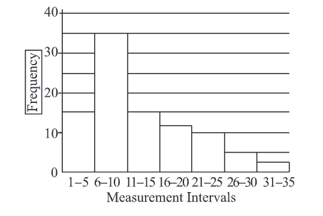

1.频率分布

21. The number of managers surveyed
who identified work experience as
an important characteristic to con-
sider was approximately what per-
cent greater than the number who
identified appropriate attire and
behavior as an important charac-
teristic to consider?
A.15%
B.20%
C.25%
D.30%
E.35%

21.在所有调查的经理中，认为工作经
验重要的比认为合适的着装和态度
重要的多多少？
解：认为工作经验重要的有72%，认为
合适的着装和行为重要的有55%，
那么(72%一55%)÷55%=31%。
答：D

22. If 48 percent of the managers sur-
veyed identified both ability to fol-
low directions and computer ex-
pertise as an important character-
istics to consider,what percent of
the managers surveyed identified
neither of these characteristics as
important to consider?
A.15%
B.18%
C.23%
D.25%
E.28%

22.如果调查的经历中有48%的人认为
执行力强和精通电脑都很重要，那
么认为这两个特征都不重要的经理
占总人数的多少？
解：65%的经理认为执行力重要，58%
认为精通电脑重要，48%的经理认
为两者都很重要，那么说明17%的
经理认为执行力重要而精通电脑并
不重要，10%的经理认为精通电脑
重要而执行力不重要；所以认为至
少有一种品质重要的经理占17%十
10%十48%=75%，所以认为两种
品质都不重要的经理占25%。
答：D

45. Which of the following is closest
to the average (arithmetic mean)
of the 9 changes in the value of
imports between consecutive years
from2000to2009?
A.260 million
B.320 million
C.400 million
D.480 million
E.640 million

45,以下选项中，哪个最接近9个变化
的平均值？9个变化指的是在2000
到2009年间，共9个连续两年间进
口值的变化。
解：9分变化求和实际上就是将2009年
的进口值9减去2000年的进口值
3.2,再除以9得到平均值为
0.64 billion,即640 million。
答：E

49. In the course of an experiment,95
measurements were recorded,and
all of the measurements were inte-
gers.The 95 measurements were
then grouped into 7 measurement
intervals.The graph above shows
the frequency distribution of the
95 measurements by measurement
interval.
Quantity A:The average (arith-
metic mean)of the 95 measure-
ments
Quantity B:The median of the 95
measurements
解：这个题要用到极限思维。当每一个
间隔里面都取最小数字的时候，所
有数据的算术平均值=(1×15十6×
35+11×15+16×12+21×10+26
×5+31×2)/95≈10.35。但是这些
数据的中位数是第48个，这个数字
一定在6一10这个区间内，6一10
区间内最大值10都小于10.35，所
以这里的算术平均值一定是大于中
位数，即A>B。

4.2 描述数据的方法
集中趋势：平均数 中位数 众数mode
分布情况：极差range，四分位数距interquatile range，标准差standard deviation

4. The table above shows the frequen-
cy distribution of the heights of 80
students.What is the least possible
range of the heights of the 80 students?
A.15
B.16
C.20
D.24
E.28

4.上表给出了80位学生的身高分布，
那么这80位学生可能的最小的极差
是多少？
解：从上表我们能看出80位学生中最高
身高可能的最小值是160，最矮身
高的最大值是144，所以最小的极
差是160一144=16。
答：B

range极差

26. In a quality-control test,50 bo-
xes-each containing 30 machine
parts-were examined for defec-
tive parts.The number of defec-
tive parts was recorded for each
box,and the average (arithmetic
mean)of the 50 recorded numbers
of defective parts per box was
1.12.Only one error was made in
recording the50 numbers:“1”de
fective part in a certain box was
incorrectly recorded as“l0”
Quantity A:The actual average
number of defective parts per box
Quantity B:0.94
A.Quantity A is greater.
B.Quantity B is greater.
C.The two quantities are equal.
D.The relationship
cannot be
determined from the information

26.在质量检测中，将对50个箱子（每
个都装30个零件)进行检查。每个
箱子中有缺陷的零件个数量将会被
记录在每个箱子上。50个箱子中有
缺陷零件数量的平均数为1.12，在
记录过程中仅有一个记录错误：有
一个箱子上的数字“1”错记成
“10”。A:实际上平均每个箱子有缺
陷的零件数量的平均数，B:0.94。
解：因为有一箱标记错误，把1写成了
10,多出来了9个有缺陷的零件。
由题意可知50箱里有缺陷的产品总
数应该是50×1.12一9=47，有缺
陷产品的平均数应该是47/50=
0.94。即A=B。
答：C

4.3 统计方法
慢慢涉及到概率 先从集合与数组开始 sets and lists

乘法原理 独立事件的统计规律

排列与阶乘 permutation and factorial
组合 combination

1. The 5 letters in the list G,H,I,J,K are to be rearranged so that G is the 3rd letter in the list and H is not next to G.How many such rearrangements are
A.60
B.36
C.24
D.12
E.6

解：G位于第三个位置且H和G不挨
着，所以H不能在第二个和第四个
位置，所以H可以在第一个或者第
五个位置。假定H在第一个位置，
那么就是剩下三个位置排三个字母，
即共A=3X2X1=6;所以H在第
五个位置的时候也是有6种排列方
式，所以一共有6+6=12种。

6. Ben has 30 pencils in a box. Each
of the pencils is one of 5 different
colors,and there are 6 pencils of
each color.If Ben selects pencils
one at a time from the box without
being able to see the pencils,what
is the minimum number of pencils
that he must select in order to en-
sure that he selects at least 2 pen-
cils of each color?
A.24
B.25
C.26
D.27
E.28

6.Ben在盒子里装了30只铅笔。30只
铅笔中有5种不同的颜色，每个颜色
有6只铅笔。如果Ben从箱子里每次
取出一支铅笔，那么为了保证每个颜
色都取出两支铅笔，他至少需要取多
少次？
解：有5种不同的颜色，每种颜色有6
个，为了确保每种颜色都至少两个，
我们可以假设先取出的24个里只有
4种颜色，每种6个，那么还需要
拿出两个才能保证每种颜色至少两
个。总共24+2=26个。

11. There are 10 people in a room.I
each person shakes hands with ex-
actly 3 other people,what is the
total number of handshakes?
A.15
B.30
C.45
D.60
E.120

解：先不考虑重复的情况下，每个人都
与3个人握手，则一共出现3×10
30次握手，但是自己与另一人握手
同时也是另一人与自己握手，即每
一次握手都被计算了两次，所以30
要除以2，即一共出现了15次握手。
答：A

另解：
先选两组 10c2=45 此时每个人和另外九个人握手 只要和另外三人 则 45/3=15

这里存在一个误区：
只需要握三次，具体握手的顺序是不强调的。很多同学在做这题的时候，局限于A和BCD三个人握手和和EFG三个人握手是不同的情况，但是题目中问的不是有多少种握手的组合，而是握手的次数，也就是不管A和BCD握手还是A和EFG握手，在总的屋手次数中这只算三次。

关于握手例题：
2:There are 7 football teams in a game.If each team plays three games with each of
the six other teams,what is the total number of games?【题意】有7只球队，每个球队和其
他6支球队都要踢3次球，一共要踢多少场比赛？
【解析】和握手题同理，虽然这题是每个组合要题3次，但是还是用上面的屋手题的解题思想来做。假设每个球队和其他6支球队踢1次，那么就是7×6：2=21场，实际题意是每个球队和其他6支球队踢3场，所以21×3=63场比赛。

有个问题 如果乘出来的结果不是2的倍数呢 如果7个队踢其他三个队 3*7=21/2=10.5 不是2的倍数 怎么办？

如上例题 当5个人和其他1个人握手 5
2个人 5\*2/2=7
3个人 5\*3/2=10.5 如下分析 应该是6

---
To answer :: Substitute 5 in place of 10. What do you get? Why?

Will there be only 6 handshakes ?

A: B, C, D -->3
B: C, D -->2
C: D --1
D:
E =0 because A, B, C, and D already shake hands with each other and only 3 exactly handshakes are allowed. So no one is left to shake hand with E.

Is my thinking correct ?

A, B, C and E have 3 handshakes each but D has only 2 handshakes.
It is not possible for D to have a 3rd handshake. That is why we get 7.5 when we use the formal method.

问题的关键在于，只和几个人握手 最后会被剩下，如果这个数是一个奇数。

---

同样的例题：例题1：Every two companies participating in a trade fair have signed a
contract,and all companies have signed 45 contracts.How many companies participate in
the trade fair?
【解析】同握手问题，假设是A和B两家公司，AB两家公司签订一份就行，不是两份。可以直接用
公式：假设共有x家公司参加交易会：x(X-1)/2=45→x=10

1.  In how many different ways can 3
identical green shirts and 3 identi-
cal red shirts be distributed among
6 children such that each child re-
ceives a shirt?
A.20
B.40
C.216
D.720
E.729

解：我们只需要考虑每个小孩分到什么
颜色即可。从6个小孩中选择3个
小孩分配某一个，那么显然剩下3
个小孩就分配另一个颜色。从6个
小孩中选出3个有C(3,6)=20种选法，
即一共有20种不同的分配方式。

或6!/3!/3！

15.N equals the number of positive 3-digit numbers that contain odd digits only.
Quantity A:N
Quantity B:125

ans:N是每个位上都是奇数的三位数的个数 5\*5*5

4.4 概率probability
随机试验random experiment 
样本空间 sample place
事件 event

不可能同时发生的事件是互斥的 mutually exclusive 
一个事件发生不会影响另一个事件是否发生 两个事件相互独立
independent 
如果事件E和F相互独立 $P(E\cap F)=P(E)P(F)$ 不独立会出现条件概率
如果事件E和F互斥 $P(E\cup F)=P(E)+P(F)$

例题：
现有三个事件ABC，他们发生的概率分别是0.23，0.4，0.85.假设事件AB互斥，CB独立，那么$P(A\cup B),P(B\cup C)$分别是多少

互斥则$P(A\cup B)=P(A)+P(B)=0.63$

独立则 $P(B\cap C)=0.4*0.85=0.34$

$P(B\cup C)=P(B)+P(C)-P(B\cap C)=0.4+0.85-0.34=0.91$

2.If the integer greater than 100 and less than 1000 is to be selected at random, what is the probability that the integer selected will be a multiple of 7

ans: 从101 到999 899个数
105=7*15
7*142=994
所以共 142-15+1=128

4.5 随机变量和概率分布
probability distribution

随机变量的平均值称为期望 expected value

正态分布 normal distribution
平均值m 标准差d

一个标准差 2/3 68%
两个标准差 96%

3.S is a set of n consecutive integers 
Quantity A:the mean of S
Quantity B:the median of S

ans:连续的整数 相等

