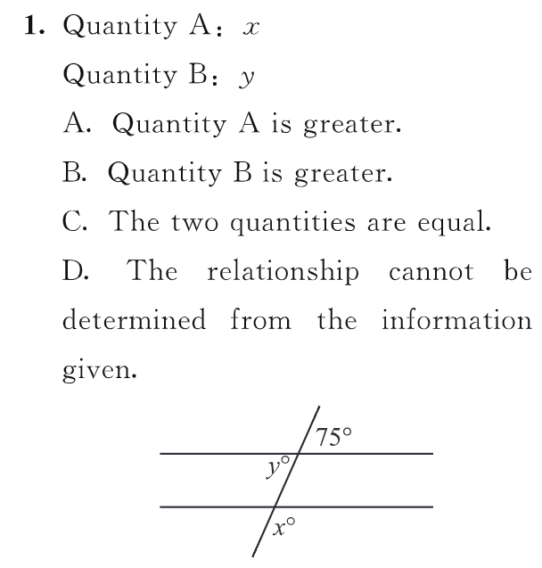

ans:D 未说明两直线平行

多边形 polygon
正多边形 regular polygon

2.A regular polygon with n sides has
interior angles that measure p degrees each.The value of p when n
8 is how much greater than the
value of p when n-6?
A.10
B.15
C.20
D.25
E.30

ans:135-120=15

三角形 triangle
等边三角形 equilateral triangle
等腰三角形 isosceles triangle
直角三角形 right triangle

全等三角形 形状和大小相等 
congruent triangle
1.三边相等2.两边和夹角3.两角和夹边

相似：similar triangle
三个角相等，三边成比例

推论:
$a^2+b^2>c^2 a,b<c$ 钝角三角形,反之锐角
已知三边长，海伦公式求解面积
$p=\frac{a+c+b}{2}$
$S=\sqrt{p(p-a){p-b}(p-c)}$

2.The dotted line segments separate
the rectangular region into six iden-
tical smaller rectangular regions.
Quantity A:The area of triangular
region WXV
Quantity B:The area of triangular
region XYV
A.Quantity A is greater.
B.Quantity B is greater.
C.The two quantities are equal.
D.The relationship
cannot
be
determined from the information giv-
en,

解：因为虚线把较大的矩形的长分成了
六个相等(identical.)的线段。所以
WX=XY,又因为△WXY和
△XYV的高都是较大矩形的宽，所
以两三角形的面积相等，即A=B。

9.Two sides of a triangle have length
6 and 8.Which of the following are
possible areas of the triangle?
I.2
II.12
III.24
A.I only
B.I and II only
C.II and III only
D.I and III only
E.I,II,and IIl

ans:E 只有最大值24，最小值接近0

3.4 四边形 quadrilateral
平行四边形 parallelogram
梯形 trapezoid
菱形 rhombus

6.The length of each side of rectangle
R is an integer,and the area of R is 36.
Quantity A:The number of possible values of the perimeter of R
Quantity B:6
A.Quantity A is greater.
B.Quantity B is greater.
C.The two quantities are equal.
D.The relationship cannot be determined from the information given.

ans:B 所有的整数 需要列举

3.5 圆 circle
弦 chord 直径 diameter 弧arc shorter arc 劣弧 longer arc优弧
切线 tangent

3.6 three-dimensional figures

1.A rectangular solid P has height 2c
and a base of width a and length b.
Two other rectangular solids,Q
and R,each have height c and ba-
ses of width a and length 6.Which
of the following represents
the amount by which the sum of the surface areas of Q and R exceeds the surface areas of P?
A.2ab
B.4ab
C.2ab+2bc
D.2ab+4ac
E.2ab +4ac +46c

ans:A
