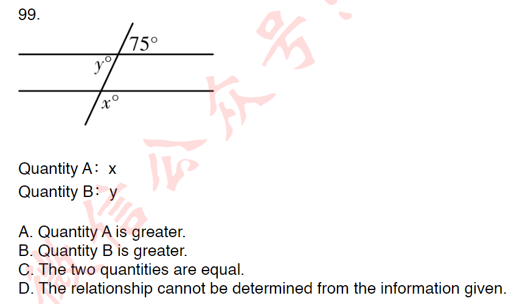
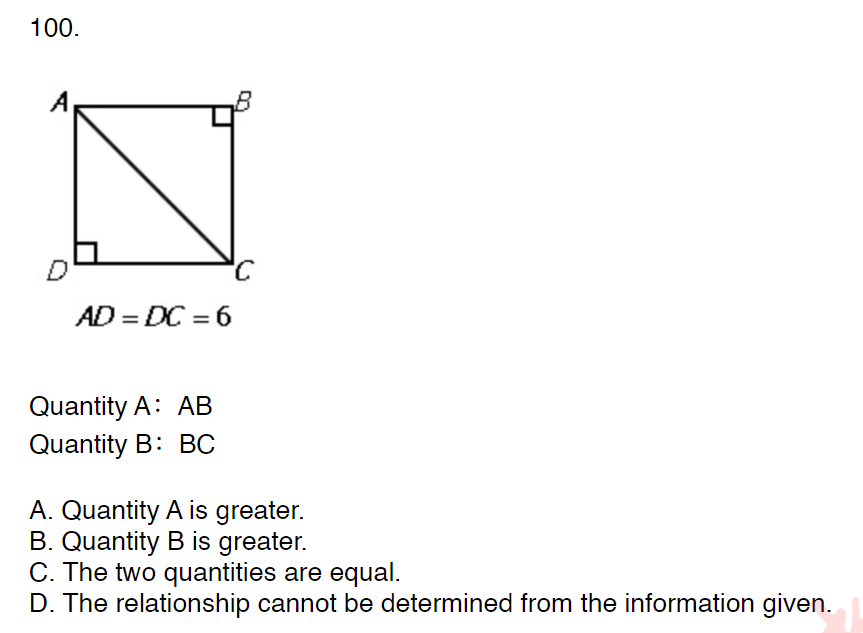
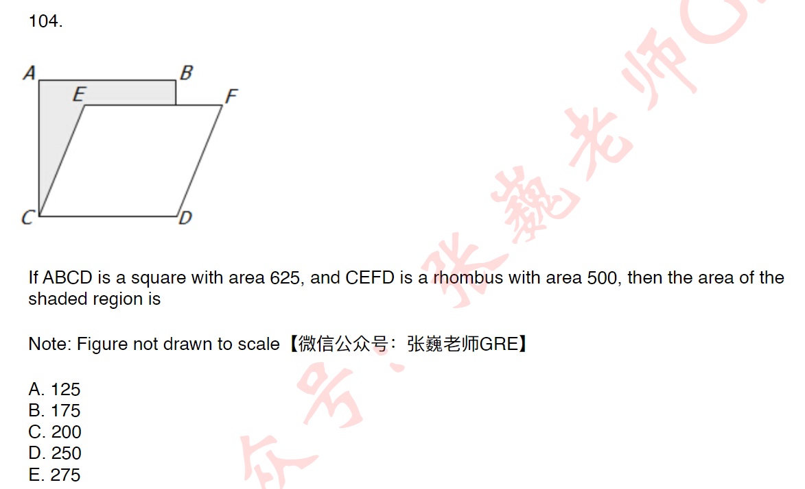

不同球放相同杯 c
相同球放不同杯 分类
不同球放不同杯 不考

2. Let S be the set of all positive integers n such that n^2 is a multiple of both 24 and 108.Which of
the following integers are divisors of every integer n in S
Indicate all such integers.
A.12
B.24
C.36
D.72

ans: 24, 108 LCM=3^3*2^3-->6^3
 216的倍数 且可开方 则为36的倍数
 又 要求找每一个n的因子
 即 题目找36的factors
ans:12 36

3. In a graduating class of 236 students,142 took algebra and 121 took chemistry.What is the
greatest possible number of students that could have taken both algebra and chemistry?

ans:24 is the least
ans:121 因为没说不能选别的课

7. The company at which Mark is employed has 80 employees,each of whom has a different
salary.Mark's salary of $43,700 is the second-highest salary in the first quartile of the 80 salaries
If the company were to hire 8 new employees at salaries that are less than the lowest of the 80
salaries,what would Mark's salary be with respect to the quartiles of the 88 salaries at the
company,assuming no other changes in the salaries?
A.The fourth-highest salary in the first quartile
B.The highest salary in the first quartile
C.The second-lowest salary in the second quartile
D.The third-lowest salary in the second quartile
E.The fifth-lowest salary in the second quartile

ans:E
min--first quartile-- median- second quartile--max
找到他的位置是第19 则+8为27th进入第二quartile

8. What is the least positive integer that is not a factor of 25!and is not a prime number?
A.26
B.28
c.36
D.56
E.58

ans:E

13. Which of the following is closest to the average (arithmetic mean)of the 9 changes in the value
of imports between consecutive years from 2000 to 2009
A.\$260 million
B.\$320 million
C.\$400 million
D.\$480 million
E.\$640 million

ans:E
9 changes 是这两年做差再除以9

21. r,s,and t are three consecutive odd integers such that $r <s <t$.
Quantity A:r+s+1
Quantity B:s +t-1
A.Quantity A is greater.
B.Quantity B is greater.
C.The two quantities are equal.
D.The relationship cannot be determined from the information given.

ans:B
偶数 奇数都针对自然数 直接做差可以 也可以利用s=1/2(r+t)

43. N=824^x,where×is a positive integer
Quantity A:the number of possible values the units digit of N
Quantity B:4
A.Quantity A is greater.
B.Quantity B is greater.
C.The two quantities are equal.
D.The relationship cannot be determined from the information given.

ans:B 问的是number

47. In a single line of people waiting to purchase tickets for a movie,there are currently 10 people
behind Shandra.If 3 of the people who are currently in line ahead of Shandra purchase tickets and
leave the line,and no one else leaves the line,there will be 8 people ahead of Shandra in line.
How many people are in the line currently?

ans:22 my:19
注意 if

58. The greatest of the 21 positive integers in a certain list is 16.The median of the 21 integers is
10.What is the least possible average (arithmetic mean)of the 21 integers?
A.4
B.5
C.6
D.7
E.8
ans:C

my:D 前十个1 10 后9个11 最后一个16
前十个1 后10个10 最后一个16

65. Set A has 50 members and set B has 53 members. At least 2 of the members in set A are not in
set B.Which of the following could be the number of members in set B that are not in set A
Indicate all such numbers.
A.53
B.5
0.13
D.25
E.50
TODO: 集合问题

ans：ABCDE
$[5,53]$

67. In a certain sequence of numbers,each term after the first term is found by multiplying the
preceding term by 2 and then subtracting 3 from the product.If the 4th term in the sequence is 19,
which of the following numbers are in the sequence?
Indicate all such numbers.
A.5
B.8
C.11
D.16
E.35

ans:ACE my:CE
要每一个选项都检查

68. For a certain probability experiment,the probability that event A will occur is 1/2 and the
probability that event B will occur is 1/3.Which of the following values could be the probability that
the event AuB(that is,the event A or B,or both)will occur?
Indicate all such values.
A.1/3
B.1/2
C.3/4

my:$[1/2,2/3]$ AB ans:BC
若互斥 1/2+1/3
若不独立 1/2 
$[1/2,5/6]$

70. Quantity A:The number of primes that are divisible by 9
Quantity B:The number of primes that are divisible by 19
A.Quantity A is greater.
B.Quantity B is greater.
C.The two quantities are equal.
D.The relationship cannot be determined from the information given.

ans:B
9和19分别做除数 被除数有多少个质数
9的倍数本身不是质数 A=0
19的倍数是质数的只有19 B=1

71. n is an even integer.
Quantity A:The number of prime factors of n
Quantity B:The number of prime factors of n/2
A.Quantity A is greater.
B.Quantity B is greater.
C.The two quantities are equal.
D.The relationship cannot be determined from the information given.

my:C 
ans: D 当n是4的倍数 多一个2

74. a and b are primes.a+b=12
Quantity A:b
Quantity B:8
A.Quantity A is greater.
B.Quantity B is greater.
C.The two quantities are equal.
D.The relationship cannot be determined from the information given.

my：D
ans：B
1不是质数 也不是合数 
2 3 5 7 
11 13 17 19

75. A and B are independent events,and the probability that both events occur is 1/2.Which of the
following could be the probability that event A occurs?
Indicate all such probabilities.
A.0
B.1/4
C.1/2
D.3/4
E.1

ans：CDE
my 没有排除b

78. In a certain state,each license plate consists of either three digits (between 0 and 9,inclusive)
followed by two letters or three letters followed by two digits.For example,055-XY,123-PP,and
AAA-70 are all acceptable plates.How many different license plates can the state issue?

my:$2*A(3,10)*A(2,26)$
ans:$10^3*26^2+26^3*10^2$
TODO：前后并不对称

81. Consider the following list of numbers that represent the number of text messages that
Geraldine received on 10 consecutive days:10,9,1,3,7,7,8,3,4,3.Which of the following
statements concerning this set of data are true?
Indicate all such lengths.
A.The median is less than the average (arithmetic mean).
B.The median is less than the mode.
C.The mode is less than the average.
D.The average of the median and the mode is between 4 and 4.5.

my:median=5 avg=5.5 mode=3 AC
ans:median=5.5 CD

84. The system of equations has how many solutions?
3x-6y=9
2y-X-3=0
A.None
B.Exactly 1
C.Exactly 2
D.Exactly 3
E.Infinitely many

my:E ans:A 斜率相等的平行线

99. 

TODO:有可能两条直线不平行 

100. 

AC相当于直径 并不能确定bc和ab的关系

101. If x>0,and two sides of a certain triangle have lengths 2x+1 and 3x+4 respectively,which of
the following could be the length of the third side of the triangle?
Indicate all possible lengths.
A.4X+5
B.X+2
C.6x+1
D.5X+6
E.2X+17

my:BD
ans:ACE
排除bd

104. 

ans:CD=25 CE=25 h=20 这里的角度不知道 ∠ACE 不是30

108. Quantity A:0.05 percent of 4000
Quantity B:1/200of4000
A.Quantity A is greater.
B.Quantity B is greater.
C.The two quantities are equal.
D.The relationship cannot be determined from the information given.

ansB my:C

109. Quantity A:22 percent of x
Quantity B:2/9 of x
A.Quantity A is greater.
B.Quantity B is greater.
C.The two quantities are equal.
D.The relationship cannot be determined from the information given.

my B ans:D 
TODO:不知道x的正负

110. Anne pays 150 percent more for a wholesale widget than Bart pays.Anne's retail price per
widget is 15 percent greater than the wholesale price she paid.Bart's retail price per widget is 185
percent greater than the wholesale price he paid.
Quantity A:Anne's retail price
Quantity B:Bart's retail price
A.Quantity A is greater.
B.Quantity B is greater.
C.The two quantities are equal.
D.The relationship cannot be determined from the information given.

my:B
anne 1.5x bart x; 
sale: anne 1.5*1.15x bart 1.85x

ans:A 注意more

TODO:复利计算

111.Diana invested $61,293 in an account with a fixed annual percent of interest,compounding
quarterly. At the end of five full years,she had \$76,662.25 in principal plus interest.Approximately
what was the annual percent rate of interest for this account?
A.1.2%
B.4.5%
C.10%
D.18%
E.25.2%

Ans:B 
${(1+r/4)}^{20}=1.25$
在计算这个1.00x的时候约等于将0.00x加了n次

所以${(1+r/4)}^{20}=1+r/4*20=1.25$ 解出r=0.05 最接近b

113. A box contains 10 balls numbered from 1 to 10 inclusive.If Ann removes a ball at random and
replaces it,and then Jane removes a ball at random,what is the probability that both women
removed the same ball?
A.1/100
B.1/90
C.1/45
D.1/10
E.41/45

my:A ans:D

120. N equals the number of positive 3-digit numbers that contain odd digits only.
Quantity A:N
Quantity B:125
A.Quantity A is greater.
B.Quantity B is greater.
C.The two quantities are equal.
D.The relationship cannot be determined from the information given.

my: $5+c15*c14*a33+a35$
ans:每个位置5种

121. From a group of 8 people,it is possible to create exactly 56 different k-person committees
Which of the following could be the value of k
Indicate all such values.
A.1
B.2
C.3
D.4
E.5
F.6
G.7

my: c28=56 BF
ans:cx8=56-->x=3 5 CE

122. A knockoff website requires users to create a password using letters from the word MAGOSH.
If each password must have at least 4 letters and no repeated letters are allowed,how many
different passwords are possible?

ans 1800  注意at least 4 letters

123.In how many different ways can 3 identical green shirts and 3 identical red shirts be
distributed among 6 children such that each child receives a shirt?
A.20
B.40
C.216
D.720
E.729

ans:A 由于每个衬衫除了颜色不同其他都相同，则从6个小孩选三个分配绿色 其他自动分配红色
C3 6=20 注意不是40 不要再去分红绿 c3 6 c3 3 已经略去了c 33

TODO：见analysisTodo

125. There are 10 people in a room.If each person shakes hands with exactly 3 other people,what
is the total number of handshakes?
A.15
B.30
C.45
D.60
E.120

ans:重复的情况下 三个人一共10*3=30 所以15

126.How many positive integers less than 10,000 are such that the product of their digits is 210?
A.24
B.30
C.48
D.54
E.72

my:2 3 5 7 a44=24 choose A
ans: 2 3 5 7; 1 6 5 7; 6 5 7;
choose D
TODO:当小于时 有可能组合出现

127. In a group of 45 children,60 percent of the children are boys,and 60 percent of the children are left-handed.
Quantity A:Number of boys who are left-handed
Quantity B:8
A.Quantity A is greater.
B.Quantity B is greater.
C.The two quantities are equal.
D.The relationship cannot be determined from the information given.

my:A
ans: boys=27 girls=16
left=27
if all girls are left, boysleft=27-16=9>8 

TODO:极限思维

128. In a group of 200 workers,10 percent of the males smoke,and 49 percent of the females
smoke.
Quantity A:Total number of workers who smoke
Quantity B:59
A.Quantity A is greater.
B.Quantity B is greater.
C.The two quantities are equal.
D.The relationship cannot be determined from the information given.

ans: C
answer must be integer, so 
TODO：自然数的默认条件

132. Quantity A:The number of prime numbers divisible by 13
Quantity B:The number of prime numbers divisible by 2
A.Quantity A is greater.
B.Quantity B is greater.
C.The two quantities are equal.
D.The relationship cannot be determined from the information given.

my:A 1 and 13; 2
ans:C 

133. Quantity A:Number of primes between 50 and 60
Quantity B:Number of primes between 80 and 90
A.Quantity A is greater.
B.Quantity B is greater.
C.The two quantities are equal.
D.The relationship cannot be determined from the information given.

my: 51 53 59;83 89
ans:C

136. x and y are integers greater than 5.x is y percent of x^2.
Quantity A:x
Quantity B:10
A.Quantity A is greater.
B.Quantity B is greater.
C.The two quantities are equal.

ans:c  xy=100

TODO:两个条件的复合

137. x is a positive integer.When x is divided by 2,4,6 or 8,the remainder is 1.
Quantity A:x
Quantity B:24
A.Quantity A is greater.
B.Quantity B is greater.
C.The two quantities are equal.
D.The relationship cannot be determined from the information given.

my:25 A
ans:D 1 或25 及以上

138. 16,000 has how many positive divisors?

ans:$1600=2^7*5^3$ 以5为底数有四个选择 以8为底数有8个选择 32

TODO: 算数和排列结合

TODO: 分类讨论
139. If x and y are integers,and w=(x2)y+x+3y,which of the following statements must be true?
Indicate all such statements.
A.If w is even,then x must be even.
B.If x is odd,then w must be odd.
C.If y is odd,then w must be odd.
D.If w is odd,then y must be odd.

ans: 原始化简为$w=(x^2+3)y+x$ 分类讨论
1.x odd, x^2+3 even -->w odd
2.x even, x^2+3 odd, 此时取决于y
2.a. y even -->w even
2.b. y odd --> w odd 

此时选择 ABC

143. If x is an odd negative integer and y is an even integer,which of the following statements must
be true?
I.(3x-2y)is odd
Il.xy2 is an even negative integer
lll.(y2-x)is an odd negative integer
A.I only
B.Il only
C.I and Il
D.I and III
E.II and III

my: C
ans:A 注意must be true
当y=0 ii不是negative

147. S is a set of n consecutive integers.
Quantity A:The mean of S
Quantity B:The median of S
A.Quantity A is greater.
B.Quantity B is greater.
C.The two quantities are equal.
D.The relationship cannot be determined from the information given.

my:D ans:C
连续很重要 不要以为中位数不能等于平均数

TODO:连续正整数额外信息

152. If n is any prime number greater than 2,which of the following CANNOT be a prime number
A.n-4
B.n-3
C.n-1
D.n+2
E.n+5

my: 排除法 2 3 5 7 11 13 17
ans: 由于所有质数都是奇数，答案在B C E 中，n=5 排除b n=3排除c
都在往唯一的偶数2上面靠

169. If the product of 7 consecutive integers is equal to the median of the integers,what is the least
of the 7 integers?

my: 七个1 consecutive
ans：乘积一定是0 中位数是0

TODO：乘积不变 全1或一个0

## 综合测试1
### section1

1.n is a positive integer,x=7n+2,and y=6n+3
Quantity A:The ones digit of x+y
Quantity B:5
A.Quantity A is greater.
B.Quantity B is greater.
C.The two quantities are equal.
D.The relationship cannot be determined from the information given.

ans:D 审题 个位数 13n+5 不确定 

3.虽然没给出具体的关系，不能确定相等但是，这两者的大小是可以比较的

17.Ifn=2×3×5×7×11Xl3X17,then which of the following statements must be true?
I.n2 is divisible by 600
II.n+19 is divisible by 19
III.(n+4)/2 is even
A.I only
B.II only
C.III only
D.I and III
E.None of the above

ans:E n/2已经是odd

### section2
2.When the even integer n is divided by 7,the remainder is 3.
Quantity A:The remainder when n is divided by 14.
Quantity B:10
A.Quantity A is greater.
B.Quantity B is greater.
C.The two quantities are equal.
D.The relationship cannot be determined from the information given.

ans: C
2.n是一个偶数，n被7除的余数是3。A：n被14除的余数，B:10。
解：设n=7k+3，其中k是一个整数。由于n是偶数，所以7k是奇数，所以k
是奇数。所以设k=2m+1,其中m是整数，则n=7(2m+1)+3=14m+
10,所以n被14除的余数是10，即A=B。
答：C

10.Greg's weekly salary is $187,which is 15 percent less than Karla's weekly
salary.If Karla's weekly salary increases by 10 percent,by what percent must
Greg's weekly salary increase in order to equal Karla's new weekly salary?
Give your answer to the nearest tenth of a percent.

ans:187/0.85*1.1=242
242-187/187=0.294=29.4%

12.If $x<y<0$,which of the following inequalities must be true?
A.$y+1<x$
B.$y-1<x$
C.$xy^2<x$ 
D.$xy<y^2$
E.$xy<x^2$

ans:E not C

19.The range of the heights of the female students in a certain class is 13.2 in-
ches,and the range of the heights of the male students in the class is 15.4 in-
ches.Which of the following statements individually provide(s)sufficient ad-
ditional information to determine the range of the heights of all the students in
the class?
Indicate all such statements.
A.The tallest male student in the class is 5.8 inches taller than the tallest fe-
male student in the class.
B.The median height of the male students in the class is 1.1 inches greater
than the median height of the female students in the class.
C.The average (arithmetic mean)height of the male students in the class is
4.6 inches greater than the average height of the female students in the class.

ans:A not AB

解：A.我们设女生中最矮的身高为x,那么女生最高身高为x十13.2，则男生最
高的身高为x十13.2=x十19，男生最矮的身高为x十3.6，所以我们能够得
到该班学生最矮身高为x,最高身高为x十19，即能够计算出极差为19，A
选项正确。
B.B选项无法决定最大值，所以B选项无法推出身高的极差。
C.算术平均数也无法决定最大值，所以C选项也无法推出学生身高的极差。

我以为中位数可以确定中间的位置，从而判断最大最小

20.How many integers from 1 to 900 inclusive have exactly 3 positive divisors?

只有质数的平方才含有三个因数。6=1,2,3,6 9=1,3,9

900以内的质数 小于30 
2 3 5 7 
11 13 17 19
23 29 十个
31 37

