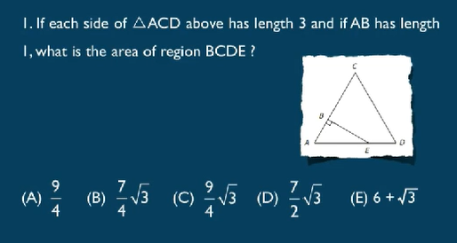
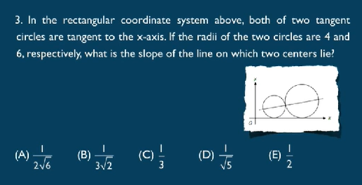

## - 三角形 四边形 triangle quadrangle rectangle square

三角形内角和180 n边形 (n-2)*180 

两边之和大于第三边，出一些不定项选择题  

大边对大角。

勾股定理：3 4 5. 5 12 13. 7 24 25.

面积 area 周长 parameter/circumference  专指圆形

ans:B

单词说法：
 equilateral triangle 等边三角形   
 isosceles triangle 等腰三角形    
 quadrilateral 四边形  quadruple 四倍的  
 平行四边形 parallelogram  
 菱形 diamond  rhombus  四边相等的四边形  
 梯形 trapezoid 
 五边形 pentagon  当p大写 五角大楼  
 六边形 hexagon  regular hexagon 正六边形
 七边形 heptagon
 八边形 octagon
 九边形 nonagon
 十边形 decagon

2.A ladder 25 feet long is leaning against a wall that is perpendicular to
level ground.The bottom of the ladder is 7 feet from the base of the
wall.If the top of the ladder slips down 4 feet,how many feet will the
bottom of the ladder slip?
(A)4
(B)5
(C)8
(D)9
(E)15

ans:C

一些单词：
    right angle 直角
    acute angle 锐角
    obtuse angle 钝角  
    对于直角三角形 短边为勾 arm 长边为股 leg 长边为弦 hypotenuse
    一般说两个legs side两点之间

---

## 圆 
面积area  周长circumference 直径diameter  半径radius
弦长 弧长arc 扇形面积  sector
同一段圆弧对应圆心角是圆周角的两倍  

I.If the number of square units in the area of circle C is
twice the number of linear units in the circumference of
C,what is the number of square units in the area?
(A)4
(B)8
(C)4π
(D)8π
(E)16π

ans:E wrong $\pi*r^2=2*2*\pi*r$
square units: 面积单位  linear units: 长度单位  

ans:A

---

## - 立体几何

长方体：rectangular solids；
正方体：cubes；
圆柱：cylinder； cylindrical 圆锥cone路障 conic；
球形：sphere spherical 

I.In a certain rectangular solid,the three sides have areas
12,15,and 20,respectively.What is the volume of the
solid?
(A)
60
(B)
120
(C)
450
(D)
1,800
(E)
3,600

ans:A sqrt 12 15 20

2.A grocer is storing small cereal boxes in large cartons that measure
25 inches by 42 inches by 60 inches.If the measurement of each small
cereal box is 7 inches by 6 inches by 5 inches,then what is the
maximum number of small cereal boxes that can be placed in each large
carton?
(A)25
(B)210
(C)252
(D)300
(E)420

guess:D 猜对了 尽可能让每个边整除  

有可能单词：
    长方体：6 面 faces；12棱 edges；8顶点 vertex/vertices

---

## - 直角坐标系

直线方程：
 斜截式：$y=kx+b$ k-slope,b-intercept  
 斜率：$k={{y_2-y_2}\over{x_2-x_1}}$  
 互相垂直 斜率product=-1  

I.In the rectangular coordinate system above,the line y =x is
perpendicular bisector of segment AB (not shown),and the x-axis is the
perpendicular bisector of segment BC(not shown).If the coordinates of
point A are (2,3),what are the coordinates of point C?
(A)(-3,-2)
(B)(-3,2)
(C)(2,-3)
(D)(3.-2)
(E)(2,3)

ans:bisector 平分线， 二等分   D  
perpendicular bisector垂直平分线  

2.In the rectangular coordinate system shown above,if the slope of line
k (not shown)is positive,which of the following statements must be
true?

▣The x-intercept of k is negative.
▣The y-intercept of k is positive.
▣k intersects the quadrant I.
▣k intersects the quadrant ll.
▣k intersects the quadrant Ill.
▣k intersects the quadrant IV.

ans:读不懂啊 intercept截距  一定穿过一三  

ans:A