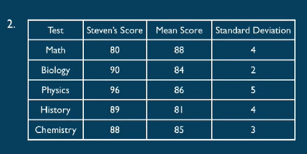

## - 利息问题 
单利和复利 simple interests: A=P(1+nr)
A为本利和，P为本金，r为利率，n为期数  

1.Mary invested \$14,000 for 3 years in a certificate of deposit paying
9.25%simple annual interest.How many more interest would Mary
have received if the interest rate on this certificate had been 9.75%
simple annual interest?
(A)\$21
(B)\$210
(C)\$420
(D)\$2,100
(E)\$4,200

ans:B

复利 compound interests:A=P(1+r)^n  

2.A 2-year certificate of deposit is purchased for k dollars.If the
certificate earns interest at an annual rate of 6 percent compounded
quarterly,which of the following represents the value,in dollars,of the
certificate at the end of the 2 years?
(A)(1.06)^2 k
(B)(1.06)^8 k
(C)(I.015)^2 k
(D)(1.015)^8 k
(E)(1.03)^4 k

ans:B wrong  annual rate for quarterly (1+6%/4) per quarter   

ans: D  拓展 semiannually 半年 结算周期越短 利息越多  

## - 集合问题 set
分类讨论 需要理清思绪  
交集：intersection 并集：union   
具体的两个题目分别对应了 韦恩图和二维表格两种解法  

1.According to a survey,93 percent of teenagers have used a computer
to play games,89 percent have used a computer to write reports,and 5
percent have not used a computer for either of these purposes.What
percent of the teenagers in the survey have used a computer both to
play games and to write reports?
(A)82%
(®)87%
(C)89%
(D)92%
(E)95%

ans:B  

2.A shipment of banners contains banners of two different shapes,triangular
and square,and two different colors,red and green.In a particular shipment
26%of the banners are square and 35%of the banners are red.If 60%of the
red banners in the shipment are square,what is the ratio of red triangular
banners to green triangular banners?
(A)7/50
(B)3/13
(C)7/30
(D)13/17
(E)35/26

ans:C  正确解法列一个表格  

## - 排列组合问题  
组合 combination：$C(n,m)=m!/(n!(m-n)!)$  
$C(n,m)=C(m-n,m)$  
排列 permutation：$P(n,n)=n!$全排列  阶乘factorial  
$P(n,m)=C(n,m)P(n,n)=m!/(m-n)! $  
$P(1,m)=C(1,m)=m$

I.In a meeting of 3 representatives from each of 6 different companies,
each person shook hands with every person not from his or her own
company.If the representatives did not shake hands with people from
their own company,how many handshakes took place?
(A)45
(B)I35
(C)144
(D)270
(E)288

ans:没看懂啊 一共几个人 6个公司每个都有3个代表。。  

解法1： 除外15人 每人15次 一共18人 则 ans=15*18/2=135  要好好考虑重复的问题  

解法2：先看大的范围 六个公司选两个 公司里再选人 
C(2,6)C(1,3)C(1,3)  

解法3：反诘。C(2,18)-6*C(2,3)  

2.If a code word is defined to be a sequence of different letters
chosen from the 10 letters A,B,C,D,E,F.G,H,I,and J,what is the
ratio of the number of 5-letter code words to the number of 4-
letter code words?
(A)5 to 4
(B)3 to 2
(C)2 to I
(D)5 to I
(E)6 to l

ans: P(5,10)/P(4,10)  
10 9 8 7 6 : 10 9 8 7 == ans:E  

## - 概率 possibilities 
色子 扑克牌之类的  possibility= target/all  

1.Six cards numbered from 1 to 6 are placed in an empty bowl.First
one card is drawn and then put back into the bowl;then a second card
is drawn.If the cards are drawn at random and if the sum of the
numbers on the cards is 8,what is the probability that one of the two
cards drawn is numbered 5？
(A)1/6(B)1/5(C)1/3(D)2/5(E)2/3  

ans: 2中情况 / 2 6 3 5 4 4  ==D  

实在不行 列一个二位表格 求和 36 种情况 和是8 一共5中  

2.If a certain coin is flipped,the probability that the coin will land heads
is 1/2.If the coin is flipped 5 times,what is the probability that it will
land heads up on the first 3 flips and not on the last 2 flips?
(A)3/5
(B)1/2
(C)I/5
(D)I/8
(E)I/32

ans: total=2^5=32 | 1* wrong  
；解法：
独立事件 每次投都独立 每次出现都是1/2   答案是E；  
如果问：3次正面 两次反面 C(3,5)*1/2^5  当选好正面的时候 反面已经确定了不需要再算。 

## - 统计学  
I.算术平均数(Average or Arithmetic Mean):所有数据之和除以数
据个数，
2.中数(Median):将所有数据从小到大排列，取中间的数或中间两
个数的算术平均数. 总数是偶数的话要求平均。 
3.众数(Mode):一组数据中出现频率最高的数.一组数据中可能有
不止一个众数.
4.极差(Range):一组数据中最大数与最小数之差.

The least and greatest numbers in a list of 7 real numbers are 2 and 20.
respectively.The median of the list is 6,and the number 3 occurs most
often in the list.Which of the following could be the average of the
numbers in the list?
$\Box$7
$\Box$8.5
$\Box$10
$\Box$11
$\Box$12.5

ans:2 3 3 6 x y 20; y>x>6
least:2 3 3 6 7 8 20 ==> avg=7
most: 2 3 3 6 18 19 20 ==> avg=71/7=10.1  
double check: avg=10 ==> sum= 70 x+y=70-34=36  
avg=8.5 ==> sum=59.5 x+y= 59.5-34=15.5>12  
avg=7 ==> sum=49 x+y=49-34=15>12 $\checkmark$  

正解： 2 3 3 6 6 6 20 最小 2 3 3 6 20 20 20 最大 exclusively  

5.四分位数(Quartile):将所有数据从小到大排列，排名
25%,50%,75%的数（不严谨）
6.四分位距(Interquartile Range):第三四分位数与第一四分
位数之差

Find the three quartiles and interquartile range of the
following numbers.
(1)11,13,15,17,19,21,23,25.
(2)11,13,15,17,19,21,23,25,27.

怎么找quartile ：
1：先找median M=18.
2: M左右分为两个数列 分别的 Mleft为 firstQuartile Mright为 thirdQuartile   

ans：
(1) Q1=14 Q2=18 Q3=22 Interquartile range=8;  
(2) Q2=19 Q1=14 Q3=24 Interquartile range=10;  

7.方差(ariance):一组数据中每个数与算术平均数
之差的平方和的算术平均数.
8.标准方差(Standard Deviation):方差的平方根

用标准差比较多。 $\sigma$  主要是计算比较麻烦，考概念。

表达： 波动性，离散型，

I.The standard deviation of four numbers a,b,c,and d is M,then
the standard deviation of which of the following MUST be M
(A)$\sqrt{a^2}\sqrt{b^2}\sqrt{c^2}\sqrt{d^2}$
(B)$a^2,b^2,c^2,d^2$
(C)2a,2b,2c,2d
(D)a+2,b+2,c+2,d+2
(E)a+2,b-2,c+2,d-2

ans:盲猜都是d  a的话相当于absolute 

方差的应用 评价数据的好坏。

The chart above shows data for five tests that Steven took.On which of
the five tests did he score highest relative to the rest of the test takers?
(A)math
(B)biology
(C)physics
(D)history
(E)chemistry

ans:C 与平均数相差的标准方差数越多 越极端。正态分布的 知识

A：80-88/4=-2
B: 90-84/2=3   $\checkmark$
C: 96-86/5=2
D: 89-81/4=2
E: 88-85/3=1

9.正态分布(Normal Distribution)
已知：1.平均数
2标准方差
记住：
1平均数正负一个标准方差之间一68%  
2平均数正负一个标准方差之间一96%  

Suppose the weights of a population of 1,000 apples from a
certain district are approximately normally distributed
with a mean of 9 ounces and a standard deviation of 1.5
ounces.Approximately how many of the apples are
between 7.5 ounces and 12 ounces weight?

ans:34+48%=82%  820